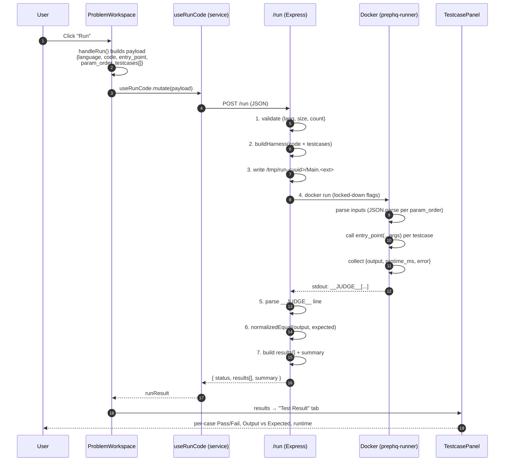

# Coding Platform — System Design Flow (Run Code)

> Visual companion to **RUN_CODE_ARCHITECTURE.md**.
> Scope: the **Run** button journey — from a click in the browser to per-testcase
> results rendered back in the UI. Pure in-house Docker, no third-party judge.

---

## 1. High-Level Component Map

```
┌──────────────────────────────────────────────────────────────────────────────┐
│                                  BROWSER (React)                               │
│                                                                                │
│   ProblemWorkspace.jsx  ── owns: language, code, problemData ──────────┐       │
│        │                                                               │       │
│        ├── WorkspaceHeader   ── [ Run ] [ Submit ] ── onRun() ─────────┤       │
│        ├── ProblemDescription                                          │       │
│        ├── CodeEditorPanel   ── language + code (controlled) ──────────┤       │
│        └── TestcasePanel     ── "Testcase" | "Test Result" tabs ◄──────┘       │
│                                                                                │
│   services/codingQuestionsServices.js                                          │
│        useRunCode()  ──►  api.post("/run", payload)   (TO BE BUILT)            │
└───────────────────────────────────┬────────────────────────────────────────────┘
                                     │  HTTPS  POST /run   { language, code,
                                     │                       entry_point, param_order,
                                     ▼                       testcases[] }
┌──────────────────────────────────────────────────────────────────────────────┐
│                              BACKEND (Node / Express)                          │
│                                                                                │
│   routes/run.js                                                                │
│     1. validate payload         4. docker run (locked-down)                    │
│     2. buildHarness()           5. capture stdout/stderr/exit/time             │
│     3. write /tmp/run-<uuid>    6. parse __JUDGE__ → compare → respond         │
└───────────────────────────────────┬────────────────────────────────────────────┘
                                     │  spawn("docker", [...])
                                     ▼
┌──────────────────────────────────────────────────────────────────────────────┐
│                          DOCKER SANDBOX (prephq-runner)                        │
│   --network none  --memory 256m  --pids-limit 64  --read-only  --cap-drop ALL  │
│                                                                                │
│   Main.js / Main.py  =  USER CODE  +  AUTO-GENERATED HARNESS                   │
│        loops over ALL sample testcases internally                              │
│        prints ONE line:  __JUDGE__[ {output, runtime_ms, error}, ... ]         │
└──────────────────────────────────────────────────────────────────────────────┘
```

---

## 2. End-to-End Sequence (Run button)



---

## 3. Data Transformation Pipeline

How a single value mutates as it travels the system:

```
ADMIN (DB)          FRONTEND            WIRE (JSON)         HARNESS (in Docker)
──────────          ────────            ───────────         ───────────────────
inputs.nums         tc.inputs.nums      "nums":"[2,7,..]"   JSON.parse("[2,7,..]")
 = "[2,7,11,15]" ─► (string, as-is) ─►  (string)        ─►   = [2,7,11,15] (real array)
                                                                     │
                                                              fn(nums, target)
                                                                     │
                                                              return [0,1]
                                                                     │
                                                         JSON.stringify([0,1]) = "[0,1]"
                                                                     │
            ┌────────────────────────────────────────────────────── ▼
            │  __JUDGE__[{ "output":"[0,1]", "runtime_ms":4, "error":null }]
            ▼
BACKEND compare:  normalizedEqual("[0,1]", expected_output "[0,1]")  →  PASS
            │
            ▼
FRONTEND renders:  ✓ Accepted | Output [0,1] | Expected [0,1] | 4ms
```

**Golden rule (from RUN_CODE_ARCHITECTURE §1):** every `inputs` value and every
`expected_output` is a **valid JSON string**. That is what lets the harness turn
strings into real typed arguments and back.

---

## 4. Backend Decision Tree (what status comes back)

```
docker run finishes
        │
        ├─ host-side 5s timeout fired? ──────────────► status: "timeout"  (TLE)
        │
        ├─ no __JUDGE__ line in stdout? ─────────────► status: "runtime_error"
        │      (compile error / crash before any case)   (error_message = stderr)
        │
        └─ __JUDGE__ line found → parse results[]
                 │
                 ├─ every case passed & no errors ───► summary.status: "Accepted"
                 ├─ some case has error ─────────────► summary.status: "Runtime Error"
                 └─ outputs differ from expected ────► summary.status: "Wrong Answer"
                        (status: "success" in all three — per-case detail in results[])
```

---

## 5. Security Boundary (the sandbox)

```
        TRUSTED                    │              UNTRUSTED (user code)
  ─────────────────────────────── │ ──────────────────────────────────────
   Express /run handler           │   Docker container  (prephq-runner)
   - validates input              │   - runs as non-root (uid 1001)
   - generates harness            │   - --network none      → no internet
   - owns comparison logic        │   - --memory 256m        → no RAM bomb
   - enforces host-side timeout   │   - --pids-limit 64      → no fork bomb
   - deletes /tmp in finally{}    │   - --read-only + tmpfs  → no disk persistence
                                  │   - --cap-drop ALL       → no privileged syscalls
   Comparison NEVER happens   ────┼──► Harness only PRODUCES outputs; it never
   inside the container.          │     decides pass/fail. Trust stays server-side.
```

---

## 6. Build Order (phases)

```
 Phase 1 (current focus)        Phase 2                  Phase 3 (Submit)
 ──────────────────────         ───────                  ────────────────
 [x] Frontend payload + console [ ] Java harness         [ ] hidden testcases (server-side)
 [ ] /run route + buildHarness  [ ] C++ harness          [ ] full-set run, verdict persisted
 [ ] JS + Python harness        [ ] per-type signatures  [ ] only pass/fail counts returned
 [ ] Docker lockdown                on the question          (never reveal hidden inputs)
 [ ] service useRunCode + wire
 [ ] TestcasePanel result UI
```

---

## 7. Cross-References

- **Request/response contracts, harness code, Docker flags:** `RUN_CODE_ARCHITECTURE.md`
- **Frontend payload builder:** `src/pages/coding/problem/ProblemWorkspace.jsx` → `handleRun()`
- **Service to add next:** `src/services/codingQuestionsServices.js` → `useRunCode()`
- **Result renderer:** `src/pages/coding/problem/components/TestcasePanel.jsx` → "Test Result" tab
```
